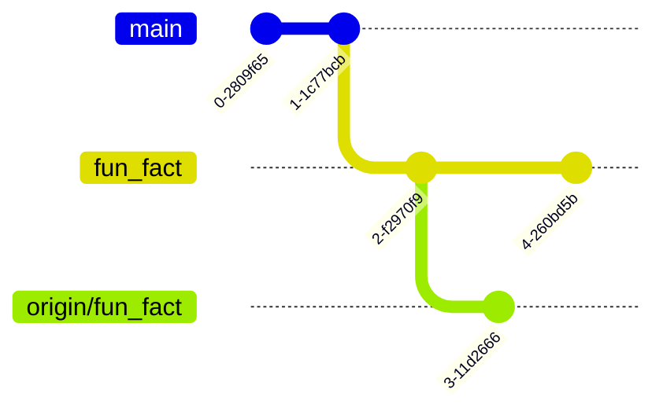

+++{"lesson_part": "main"}

# How do git branches work?

Today we are going to work with branches offline to begin to understand them better. 

+++{"lesson_part": "main"}
## Git cheatsheets

High quality, correct refrences are important to gaining an understanding and being able to use tools well. 

```{attention}
Checking for factual information is not reliable in LLMs. They can be a helpful coding assistant when you know what you want, but they generate text without regard for the factuality of the text[^bullshit]. You have to check it for correctness. 
```

[^bullshit]: See, for example [ChatGPT is Bullshit](https://link.springer.com/article/10.1007/s10676-024-09785-3) in Ethics and Information Technology. If you find this interesting you could do a [discussion community badge](community:article)

- [visual cheatsheet](https://ndpsoftware.com/git-cheatsheet.html#loc=index;)
- [github cheatsheet in many languages](https://training.github.com/)
- [complete official docs](https://git-scm.com/docs)

We are going to work between the browser and locally in order to simulate scenarios that most often occur in collaboration, but can also occur working alone as well. 


+++{"lesson_part": "site"}

We reviewed paths and how `cd` works to start. The key points of the review is that
- `cd` is equivalent to `cd ~` 
- `~` is a shortcut for your 'home' directory, mine is `/Users/brownsarahm`

+++{"lesson_part": "main"}
## Back to the gh-inclass repo
Recall, We can move around and examine the computer's file structure using shell commands.

Open a new terminal window and navigate to your folder for the course (the one that contains other folders)

```{code-cell} bash
:tags: ["skip-execution"]
cd Documents/inclass/systems/gh-inclass-fa25-brownsarahm/
```


+++{"lesson_part": "main"}

Let's check where we left off
```{code-cell} bash
:tags: ["skip-execution"]
git status
```

+++{"lesson_part": "main","type":"output"}

```{code-block} console
On branch 1-add-a-readme
Your branch is ahead of 'origin/1-add-a-readme' by 1 commit.
  (use "git push" to publish your local commits)

nothing to commit, working tree clean
```

+++{"lesson_part": "main"}

We had made a commit, but not yet sent it to GitHub. This commit was only on our local systems, but not on GitHub. 

To send it there we use `git push` 

:::::::{margin}
::::{seealso}
See the [docs](https://git-scm.com/docs/git-push) for `push` to learn even more details and see the options. 
::::
:::::::

```{code-cell} bash
:tags: ["skip-execution"]
git push
```

+++{"lesson_part": "main","type":"output"}

```{code-block} console
Enumerating objects: 4, done.
Counting objects: 100% (4/4), done.
Delta compression using up to 16 threads
Compressing objects: 100% (2/2), done.
Writing objects: 100% (3/3), 311 bytes | 311.00 KiB/s, done.
Total 3 (delta 0), reused 0 (delta 0), pack-reused 0 (from 0)
To https://github.com/compsys-progtools/gh-inclass-fa25-brownsarahm.git
   c8f4926..99f86bf  1-add-a-readme -> 1-add-a-readme
```

+++{"lesson_part": "main"}

Now we check status again

```{code-cell} bash
:tags: ["skip-execution"]
git status
```

+++{"lesson_part": "main","type":"output"}

```{code-block} console
On branch 1-add-a-readme
Your branch is up to date with 'origin/1-add-a-readme'.

nothing to commit, working tree clean
```
and it says it is all up to date

+++{"lesson_part": "main"}

(fix-fork)=
## Fixing the fork 

Next, we will look at the repo in the browser and work with it from there. We can navigate normally or using `gh` to open in the browser. 

```{code-cell} bash
:tags: ["skip-execution"]
gh repo view
```

+++{"lesson_part": "main","type":"output"}

```{code-block} console
X No default remote repository has been set. To learn more about the default repository, run: gh repo set-default --help

please run `gh repo set-default` to select a default remote repository.
```

Since GitHub classroom works by making a {term}`fork`, `gh` does not know if we want to go to our individual repos or the base they were all forked from. 

+++{"lesson_part": "main"}

To review how to use the command, we will use its `--help`

```{code-cell} bash
:tags: ["skip-execution"]
gh repo set-default --help
```

+++{"lesson_part": "main","type":"output"}

```{code-block} 
:emphasize-lines: 15

This command sets the default remote repository to use when querying the
GitHub API for the locally cloned repository.

gh uses the default repository for things like:

 - viewing and creating pull requests
 - viewing and creating issues
 - viewing and creating releases
 - working with GitHub Actions

### NOTE: gh does not use the default repository for managing repository and environment secrets.

USAGE
  gh repo set-default [<repository>] [flags]

FLAGS
  -u, --unset   Unset the current default repository
  -v, --view    View the current default repository

INHERITED FLAGS
  --help   Show help for command

EXAMPLES
  # Interactively select a default repository
   gh repo set-default

  # Set a repository explicitly
   gh repo set-default owner/repo

  # View the current default repository
   gh repo set-default --view

  # Show more repository options in the interactive picker
   git remote add newrepo https://github.com/owner/repo
   gh repo set-default

LEARN MORE
  Use 'gh <command> <subcommand> --help' for more information about a command.
  Read the manual at https://cli.github.com/manual
  Learn about exit codes using 'gh help exit-codes'
  Learn about accessibility experiences using 'gh help accessibility'

```


+++{"lesson_part": "main"}
This tells us to use the command with the `owner/repo` form of the repo name for the one we want to use. For me this means: 

```{code-cell} bash
:tags: ["skip-execution"]
gh repo set-default compsys-progtools/gh-inclass-fa25-brownsarahm
```

Your part after the `/` would be your own repo name, instead of mine. 

+++{"lesson_part": "main","type":"output"}

```{code-block} console
✓ Set compsys-progtools/gh-inclass-fa25-brownsarahm as the default repository for the current directory
```

+++{"lesson_part": "main"}

Now we can use the original command
```{code-cell} bash
:tags: ["skip-execution"]
gh repo view
```

+++{"lesson_part": "main","type":"output"}

```{code-block} console
compsys-progtools/gh-inclass-fa25-brownsarahm
compsys-progtools-fall25-gh-inclass-template-gh-inclass created by GitHub Classroom

This repository does not have a README

View this repository on GitHub: https://github.com/compsys-progtools/gh-inclass-fa25-brownsarahm
```

+++{"lesson_part": "main"}
or with its `--web` option we can get it to open in the system default browser. 

```{code-cell} bash
:tags: ["skip-execution"]
gh repo view --web
```

+++{"lesson_part": "main","type":"output"}

```{code-block} console
Opening https://github.com/compsys-progtools/gh-inclass-fa25-brownsarahm in your browser.
```


+++{"lesson_part": "main"}

## Branches do not sync automatically 

Now we will look in GitHub and see what is there. 

+++{"lesson_part": "main"}

We made a PR for the about branch and merged it in browser. 

Then in the browser the `about.md` file exists on the main branch. 

+++{"lesson_part": "main"}

Back on our local computer, we will go back to the main branch, using `git checkout`

```{code-cell} bash
:tags: ["skip-execution"]
git checkout main
```

+++{"lesson_part": "main","type":"output"}

```{code-block} console
Switched to branch 'main'
Your branch is up to date with 'origin/main'.
```

+++{"lesson_part": "main"}

now we look at the status of our repo: 
```{code-cell} bash
:tags: ["skip-execution"]
ls
```

+++{"lesson_part": "main","type":"output"}

```{code-block} console
```

the file is missing.  It said it was up to date with origin main, but that is the most recent time we checked github only.  It's up to date with our local record of what is on GitHub, not the current GitHub. 


+++{"lesson_part": "main"}
Let's check in with git again

```{code-cell} bash
:tags: ["skip-execution"]
git status
```

+++{"lesson_part": "main","type":"output"}

```{code-block} console
On branch main
Your branch is up to date with 'origin/main'.

nothing to commit, working tree clean
```

It thinks it is up to date, but it is not because git does not sync automatically. 

This manual control means that someone can break something in one place and you can fix it from another copy, it is an *advantage* but we have to do a bit of work. 

+++{"lesson_part": "main"}

Next, we will update locally, with `git fetch`


+++{"lesson_part": "main"}

```{code-cell} bash
:tags: ["skip-execution"]
git fetch
```

+++{"lesson_part": "main","type":"output"}

```{code-block} console
remote: Enumerating objects: 1, done.
remote: Counting objects: 100% (1/1), done.
remote: Total 1 (delta 0), reused 0 (delta 0), pack-reused 0 (from 0)
Unpacking objects: 100% (1/1), 913 bytes | 456.00 KiB/s, done.
From https://github.com/compsys-progtools/gh-inclass-fa25-brownsarahm
   c8f4926..11017a5  main       -> origin/main
```


+++{"lesson_part": "main"}


Here we see 2 sets of messages.  Some lines start with "remote" and other lines do not. 
The "remote" lines are what `git` on the GitHub server said in response to our request and the 
other lines are what `git` on your local computer said. 

So, here, it counted up the content, and then sent it on GitHub's side. On the local side, it unpacked (remember git compressed the content before we sent it). It describes the changes that were made on the 
GitHub side, the main branch was moved from one commit to another. So it then updates the local main branch accordingly ("Updating c8f4926..11017a55").

:::::{important}
The hashes, here `c8f4926..11017a5` will be unique in every project, but that stands for the commits that have been sent from one location to the other
:::::


+++{"lesson_part": "main"}
  
We can see that if this updates the working directory too: 

```bash
ls
```

+++{"lesson_part": "main"}
no changes yet. `fetch` updates the .git directory so that git knows more, but does not update our local file system. 

+++{"lesson_part": "main"}
We can see that with `status`

```{code-cell} bash
:tags: ["skip-execution"]
git status
```

+++{"lesson_part": "main","type":"output"}

```{code-block} console
On branch main
Your branch is behind 'origin/main' by 2 commits, and can be fast-forwarded.
  (use "git pull" to update your local branch)

nothing to commit, working tree clean
```

It tells us the the branch can be fast forwarded, this is one of the ways that branches can be updated from another branch. 

+++{"lesson_part": "main"}

(fastforward)=
### Fast Forward

Before
```{mermaid}
gitGraph
    commit id:"A"
    commit id:"B"
    branch origin/main
    checkout origin/main
    commit id:"C"
    commit id:"D"
```

After:

```{mermaid}
gitGraph
    commit id:"A"
    commit id:"B"
    commit id:"C"
    commit id:"D"
```

Fast forward can only happen where there are stictly more commits on the incoming branch. (here the remote branch that we have fetched)

+++{"lesson_part": "main"}

(rebase)=
### Git Rebase

Rebase changes the {term}`base` commit of a branch. It works by changing the parent of the first commit that is unique to the current branch and then making new versions of the previous commits on the branch. 

(rebase:before)=

::::::{tab-set}
:::::{tab-item} Before
```{mermaid}
gitGraph
    commit id:"D"
    commit id:"E"
    branch topic
    checkout topic
    commit id:"A"
    checkout main
    commit id:"F"
    checkout topic
    commit id:"B"
    checkout main
    commit id:"G"
    checkout topic
    commit id:"C" tag: "head"
```

:::::
:::::{tab-item} After

(rebase:after)=


```{mermaid}
gitGraph
    commit id:"D"
    commit id:"E"
    commit id:"F"
    commit id:"G"
    branch topic
    checkout topic
    commit id:"A-new"
    commit id:"B-new"
    commit id:"C-new"
    checkout main
```

:::::
:::::::

:::::{seealso}
the [rebase docs](https://git-scm.com/docs/git-rebase.html) have a lot more examples (though they're text images)
:::::

+++{"lesson_part": "site"}

### Git Merge

is one the third option for how to handle it, if we choose `--no-rebase` it will use merge. Merge instead adds as new commit that contains all of the changes to the new {term}`base branch`

::::::{margin}
:::{hint}
this is the same as what happens when we merge a PR (but run on the server)
:::
:::::::

```{mermaid}
gitGraph
    commit id:"D"
    commit id:"E"
    branch origin/main
    checkout origin/main
    commit id:"A"
    checkout main
    commit id:"F"
    checkout origin/main
    commit id:"B"
    checkout main
    commit id:"G"
    checkout origin/main
    commit id:"C"
    checkout main
    merge origin/main id:"H (contains A,B,C)"
```


+++{"lesson_part": "main"}

We can use the fast forward option, so we will with `pull`
```{code-cell} bash
:tags: ["skip-execution"]
git pull
```

+++{"lesson_part": "main","type":"output"}

```{code-block} console
Updating c8f4926..11017a5
Fast-forward
 README.md | 3 +++
 1 file changed, 3 insertions(+)
 create mode 100644 README.md
```

This tells us:
- what commit was moved from `c8f4926` and to `11017a5`
- what method was used (`Fast-forward`)
- for each changed file, how many lines were added (and removed, but not here) ` README.md | 3 +++`= 3 lines were added to the readme file. 
- a total number of changed files and lines (`1 file changed, 3 insertions(+)`)
- and any created files or folders `create mode 100644 README.md` - the mode says that it is a normal file. 

+++{"lesson_part": "main"}
Now we can check our local folder

```{code-cell} bash
:tags: ["skip-execution"]
ls
```

+++{"lesson_part": "main","type":"output"}

```{code-block} console
README.md
```

the file is there! 


:::::{exercise}
:label: branch-create

Try each of the following. Figure out what each one does. Check them and be sure of everything it does. 

- `git checkout my_branch_checkedout`
- `git checkout -b my_branch_checkedoutb`
- `git branch create my_branch_created`
- `git branch my_branch; git checkout my_branch`

:::::

:::::{solution} branch-create
:dropdown

- using `checkout` with a nonexistant branch name causes an error
- `-b` creates a branch
- `create` is not a git command, so it throws an error
- `git branch` creates a new branch, `;` lets us run 2 commands at once, `checkout` switches
::::::

+++{"lesson_part": "main"}

With no options or inputs, `git branch` will list the branches that exist. 
```{code-cell} bash
:tags: ["skip-execution"]
git branch
```

+++{"lesson_part": "main","type":"output"}

```{code-block} console
  1-add-a-readme
  main
* my_branch
  mybranchcheckedoutb
```

+++{"lesson_part": "main"}

## making a new branch locally

We've used `git checkout` to switch branches before.  To also create a branch at the same time, we use the `-b` option. 

+++{"lesson_part": "main"}

```{code-cell} bash
:tags: ["skip-execution"]
git checkout -b fun_fact
```

+++{"lesson_part": "main","type":"output"}

```{code-block} console
Switched to a new branch 'fun_fact'
```

+++{"lesson_part": "main"}
we can view the commit history with `git log` 

```{code-cell} bash
:tags: ["skip-execution"]
git log
```

+++{"lesson_part": "main","type":"output"}

branches are like pointers, they point to a commit. 

```{code-block} console
commit 11017a59088d4a0b880f770f15fab8c9e086a789 (HEAD -> fun_fact, origin/main, origin/HEAD, mybranchcheckedoutb, my_branch, main)
Merge: c8f4926 99f86bf
Author: Sarah Brown <brownsarahm@uri.edu>
Date:   Tue Sep 16 19:51:36 2025 +0300

    Merge pull request #2 from compsys-progtools/1-add-a-readme
    
    create a readme closes #1

commit 99f86bf7112debc934e7fa4504232a48266d90e4 (origin/1-add-a-readme, 1-add-a-readme)
Author: Sarah M Brown <brownsarahm@uri.edu>
Date:   Thu Sep 11 13:41:24 2025 -0400

    create a readme closes #1

commit c8f4926313ba8f6c5bfad3857b7479a666328e6d
Author: github-classroom[bot] <66690702+github-classroom[bot]@users.noreply.github.com>
Date:   Thu Sep 11 14:49:01 2025 +0000

```

+++{"lesson_part": "main"}


we can use the [nano text editor](https://www.nano-editor.org/dist/latest/nano.html).  `nano` is simpler than other text editors that tend to be more popular among experts, `vim` and `emacs`.  Getting comfortable with nano will get you used to the ideas, without putting as much burden on your memory.  This will set you up to learn those later, if you need a more powerful terminal text editor. 


+++{"lesson_part": "main"}

```{code-cell} bash
:tags: ["skip-execution"]
nano about.md
```


this opens the nano program on the terminal.  it displays reminders of the commands at the bottom of th screen and allows you to type into the file right away. 

++{"lesson_part": "main"}

Add any fun fact on the line below your content.  Then, write out (save), it will prompt the file name.  Since we opened nano with a file name (`about.md`) specified, you will not need to type a new name, but to confirm it, by pressing enter/return. 

+++{"lesson_part": "main"}

```{code-cell} bash
:tags: ["skip-execution"]
cat about.md 
```

+++{"lesson_part": "main","type":"output"}

```{code-block} console
# About me

my major was EE

```

+++{"lesson_part": "main"}

```{code-cell} bash
:tags: ["skip-execution"]
git status
```

+++{"lesson_part": "main","type":"output"}

```{code-block} console
On branch fun_fact
Untracked files:
  (use "git add <file>..." to include in what will be committed)
	about.md

nothing added to commit but untracked files present (use "git add" to track)
```

+++{"lesson_part": "main"}

This is very similar to when we checked after creating the file before, but, notice a few things are different.  
- the first line tells us the branch but does not compare to origin. (this branch does not have a linked branch on GitHub)
- thefile is listed as "not staged" instead of untracked
- it gives us the choice to add it to then commit OR to restore it to undo the changes


We will add it to stage

+++{"lesson_part": "main"}

```{code-cell} bash
:tags: ["skip-execution"]
git add about.md 
```


+++{"lesson_part": "main"}
then check the status again
```{code-cell} bash
:tags: ["skip-execution"]
git status
```

+++{"lesson_part": "main","type":"output"}

we see that it is staged and git tells us how to undo this if we want
```{code-block} console
On branch fun_fact
Changes to be committed:
  (use "git restore --staged <file>..." to unstage)
	new file:   about.md

```

+++{"lesson_part": "main"}


and commit: 

+++{"lesson_part": "main"}

**we are going to do it without the `-m` on purpose here to learn how to fix it**


```{code-cell} bash
:tags: ["skip-execution"]
git commit 
```

+++{"lesson_part": "main"}
(vimcommit)=
:::::{attention}
without a commit message `git commit` puts you in vim. Read the content carefully, then press `a` to get into ~insert~ mode. Type your message and/or uncomment the template. 

When you are done use `escape` to go back to command mode, the ~insert~ at the bottom of the screen will go away.  Then type `:wq` and press <kbd>enter</kbd> /return. 
::::::

+++{"lesson_part": "main"}

What this is doing is adding a temporary file with the commit message that git can use to complete your commit. 

+++{"lesson_part": "main","type":"output"}

then it will tell us we made a commit
```{code-block} console
[fun_fact 216b5d4] start about file
 1 file changed, 4 insertions(+)
 create mode 100644 about.md
```

+++{"lesson_part": "main"}
Now we can look again at where our branch pointers are. 

```{code-cell} bash
:tags: ["skip-execution"]
git log 
```

+++{"lesson_part": "main","type":"output"}
Now only the `HEAD` pointer and `fun_fact` branch moved foward

```{code-block} console
commit 216b5d4d8a7630626ce0e7997aa89678d340d680 (HEAD -> fun_fact)
Author: Sarah M Brown <brownsarahm@uri.edu>
Date:   Tue Sep 16 13:13:38 2025 -0400

    start about file

commit 11017a59088d4a0b880f770f15fab8c9e086a789 (origin/main, origin/HEAD, mybranchcheckedoutb, my_branch, main)
Merge: c8f4926 99f86bf
Author: Sarah Brown <brownsarahm@uri.edu>
Date:   Tue Sep 16 19:51:36 2025 +0300

    Merge pull request #2 from compsys-progtools/1-add-a-readme
    
    create a readme closes #1

commit 99f86bf7112debc934e7fa4504232a48266d90e4 (origin/1-add-a-readme, 1-add-a-readme)
Author: Sarah M Brown <brownsarahm@uri.edu>
Date:   Thu Sep 11 13:41:24 2025 -0400

    create a readme closes #1
```

+++{"lesson_part": "main"}

Now we will push to github. 
```{code-cell} bash
:tags: ["skip-execution"]
git push
```

+++{"lesson_part": "main","type":"output"}

```{code-block} console
fatal: The current branch fun_fact has no upstream branch.
To push the current branch and set the remote as upstream, use

    git push --set-upstream origin fun_fact

To have this happen automatically for branches without a tracking
upstream, see 'push.autoSetupRemote' in 'git help config'.

```

It cannot push, because it does not know where to push, like we noted above that it did not comapre to origin, that was beecause it does not have an "upstream branch" or a corresponding branch on a remote server. 
It does not work at first because this branch does not have a remote. 

+++{"lesson_part": "main"}

git stores its list of remotes in a `.git/config` file

```bash
cat .git/config 
```

```{code-block} console
[core]
	repositoryformatversion = 0
	filemode = true
	bare = false
	logallrefupdates = true
	ignorecase = true
	precomposeunicode = true
[remote "origin"]
	url = https://github.com/compsys-progtools/gh-inclass-fa25-brownsarahm.git
	fetch = +refs/heads/*:refs/remotes/origin/*
	gh-resolved = base
[branch "main"]
	remote = origin
	merge = refs/heads/main
[branch "1-add-a-readme"]
	remote = origin
	merge = refs/heads/1-add-a-readme
```

we can see our other branches have `remote = origin` but our new branch is not there. 


+++{"lesson_part": "main"}


To fix it, we do as git said. 

```{code-cell} bash
:tags: ["skip-execution"]
git push --set-upstream origin fun_fact
```

+++{"lesson_part": "main","type":"output"}

```{code-block} console
Enumerating objects: 4, done.
Counting objects: 100% (4/4), done.
Delta compression using up to 16 threads
Compressing objects: 100% (2/2), done.
Writing objects: 100% (3/3), 340 bytes | 340.00 KiB/s, done.
Total 3 (delta 0), reused 0 (delta 0), pack-reused 0 (from 0)
remote: 
remote: Create a pull request for 'fun_fact' on GitHub by visiting:
remote:      https://github.com/compsys-progtools/gh-inclass-fa25-brownsarahm/pull/new/fun_fact
remote: 
To https://github.com/compsys-progtools/gh-inclass-fa25-brownsarahm.git
 * [new branch]      fun_fact -> fun_fact
branch 'fun_fact' set up to track 'origin/fun_fact'.
```


This time the returned message from the remote includes the link to the page to make a PR. We are not goign to make the PR though

+++{"lesson_part": "main"}

and we can see that now our config has changed: 

```{code-cell} bash
:tags: ["skip-execution"]
cat .git/config 
```

+++{"lesson_part": "main","type":"output"}

```{code-block} console
[core]
	repositoryformatversion = 0
	filemode = true
	bare = false
	logallrefupdates = true
	ignorecase = true
	precomposeunicode = true
[remote "origin"]
	url = https://github.com/compsys-progtools/gh-inclass-fa25-brownsarahm.git
	fetch = +refs/heads/*:refs/remotes/origin/*
	gh-resolved = base
[branch "main"]
	remote = origin
	merge = refs/heads/main
[branch "1-add-a-readme"]
	remote = origin
	merge = refs/heads/1-add-a-readme
[branch "fun_fact"]
	remote = origin
	merge = refs/heads/fun_fact
```

+++{"lesson_part": "main"}

## Merge conflicts

We are going to *intentionally* make a merge conflict here. 

This means we are learning two things: 
- what *not* to do if you can avoid it
- how to fix it when a merge conflict occurs

Merge conflicts are not **always** because someone did something wrong; it can be a conflict in the 
simplest term because two people did two types of work that were supposed to be independent, but 
turned out not to be. 
+++{"lesson_part": "main"}

### Make conflicting edits
First, in your browser edit the `about.md` file on the `fun_fact` branch to have a second fun fact. 

+++{"lesson_part": "main"}
Then edit it locally to also have 2 fun facts. 
```{code-cell} bash
:tags: ["skip-execution"]
nano about.md 
```

+++{"lesson_part": "main"}
Now, we can visually compare, the local content: 
```{code-cell} bash
:tags: ["skip-execution"]
cat about.md 
```

+++{"lesson_part": "main","type":"output"}


```{code-block} console
# About me

my major was EE
i started at URI in 2020
```

And on GitHub: 

```{code} 
:filename: about.md
# About me

my major was EE
i skied competively in HS
```

::::{attention}
Notice they have the same first few lines and the last line is edited differently. 
:::::

+++{"lesson_part": "main"}
### Git won't let us lose work
now that we have edited in both places let's pull. 

```{code-cell} bash
:tags: ["skip-execution"]
git pull
```

+++{"lesson_part": "main","type":"output"}

```{code-block} console
remote: Enumerating objects: 3, done.
remote: Counting objects: 100% (1/1), done.
remote: Total 3 (delta 1), reused 1 (delta 1), pack-reused 2 (from 1)
Unpacking objects: 100% (3/3), 964 bytes | 321.00 KiB/s, done.
From https://github.com/compsys-progtools/gh-inclass-fa25-brownsarahm
   216b5d4..4f8c753  fun_fact   -> origin/fun_fact
Updating 216b5d4..4f8c753
error: Your local changes to the following files would be overwritten by merge:
	about.md
Please commit your changes or stash them before you merge.
Aborting
```

It does not work because we have not committed. 

This is helpful beacause it prevents us from losing any work. 
+++{"lesson_part": "main"}

```{code-cell} bash
:tags: ["skip-execution"]
git status
```

+++{"lesson_part": "main","type":"output"}

```{code-block} console
On branch fun_fact
Your branch is behind 'origin/fun_fact' by 1 commit, and can be fast-forwarded.
  (use "git pull" to update your local branch)

Changes not staged for commit:
  (use "git add <file>..." to update what will be committed)
  (use "git restore <file>..." to discard changes in working directory)
	modified:   about.md

no changes added to commit (use "git add" and/or "git commit -a")
```

we can add and commit at the same time using the `-a` option from the `git commit``

+++{"lesson_part": "main"}

```{code-cell} bash
:tags: ["skip-execution"]
git commit -a -m 'another fun fact'
```

+++{"lesson_part": "main","type":"output"}

### Pull to combine 
```{code-block} console
[fun_fact 37d36fa] another fun fact
 1 file changed, 1 insertion(+), 1 deletion(-)
```

+++{"lesson_part": "main"}
so we try again
```{code-cell} bash
:tags: ["skip-execution"]
git pull
```

+++{"lesson_part": "main","type":"output"}

```{code-block} console
hint: You have divergent branches and need to specify how to reconcile them.
hint: You can do so by running one of the following commands sometime before
hint: your next pull:
hint:
hint:   git config pull.rebase false  # merge
hint:   git config pull.rebase true   # rebase
hint:   git config pull.ff only       # fast-forward only
hint:
hint: You can replace "git config" with "git config --global" to set a default
hint: preference for all repositories. You can also pass --rebase, --no-rebase,
hint: or --ff-only on the command line to override the configured default per
hint: invocation.
fatal: Need to specify how to reconcile divergent branches.
```
+++{"lesson_part": "main"}

Now it cannot work because the branches have {term}`diverged <divergent>`.  This illustrates the fact that our two versions of the branch `fun_fact` and `origin/fun_fact` are two separate things.  


+++{"lesson_part": "main"}



+++{"lesson_part": "main"}

```{code-cell} bash
:tags: ["skip-execution"]
git pull
```

+++{"lesson_part": "main","type":"output"}

```{code-block} console
hint: You have divergent branches and need to specify how to reconcile them.
hint: You can do so by running one of the following commands sometime before
hint: your next pull:
hint:
hint:   git config pull.rebase false  # merge
hint:   git config pull.rebase true   # rebase
hint:   git config pull.ff only       # fast-forward only
hint:
hint: You can replace "git config" with "git config --global" to set a default
hint: preference for all repositories. You can also pass --rebase, --no-rebase,
hint: or --ff-only on the command line to override the configured default per
hint: invocation.
fatal: Need to specify how to reconcile divergent branches.
```


+++{"lesson_part": "main"}
### Solve divergent branches
git gave us some options, we will use [rebase](#rebase) which will apply our local commits *after* the remote commits. 

+++{"lesson_part": "main"}

```{code-cell} bash
:tags: ["skip-execution"]
git pull --rebase
```

+++{"lesson_part": "main","type":"output"}

```{code-block} console
Auto-merging about.md
CONFLICT (content): Merge conflict in about.md
error: could not apply 37d36fa... another fun fact
hint: Resolve all conflicts manually, mark them as resolved with
hint: "git add/rm <conflicted_files>", then run "git rebase --continue".
hint: You can instead skip this commit: run "git rebase --skip".
hint: To abort and get back to the state before "git rebase", run "git rebase --abort".
hint: Disable this message with "git config set advice.mergeConflict false"
Could not apply 37d36fa... another fun fact
```

Now it tells us there is a conflict.

+++{"lesson_part": "main"}


We have to fix the conflict manually because there were 2 different edits to the same line of the same file, git cannot tell which one we want. 

We do that using a text editor: 

```{code-cell} bash
:tags: ["skip-execution"]
nano about.md 
```

+++{"lesson_part": "main","type":"output"}
When we first open it has some added lines (as highlighted below):

```{code-block} console
:filename: about.md
:linenos:
:emphasize-lines:  4,6,8
# About me

my major was EE
<<<<<<< HEAD 
i skied competively in HS
=======
i started at URI in 2020
>>>>>>> 
```

to fix, in this case, we want all of the lines so we edit that way.  Otherwise you could manually edit to choose one or the other. 


We have to  manually edit it to be what we want it to be.  We can take one change the other or both. 

+++{"lesson_part": "main","type":"output"}
In this case, I want both so my file looks like this when I am done, then I [close and save](#nanosaveedit). 
```{code-block} console
# About me

my major was EE
i skied competively in HS
i started at URI in 2020
```

+++{"lesson_part": "main"}
now we check with git again

```{code-cell} bash
:tags: ["skip-execution"]
git status
```

+++{"lesson_part": "main","type":"output"}

```{code-block} console
interactive rebase in progress; onto 4f8c753
Last command done (1 command done):
   pick 37d36fa another fun fact
No commands remaining.
You are currently rebasing branch 'fun_fact' on '4f8c753'.
  (fix conflicts and then run "git rebase --continue")
  (use "git rebase --skip" to skip this patch)
  (use "git rebase --abort" to check out the original branch)

Unmerged paths:
  (use "git restore --staged <file>..." to unstage)
  (use "git add <file>..." to mark resolution)
	both modified:   about.md

no changes added to commit (use "git add" and/or "git commit -a")
```

+++{"lesson_part": "main"}
Now we add and commit, with a message doing both options at once. 
```{code-cell} bash
:tags: ["skip-execution"]
git commit -a -m 'resolve conflict'
```

+++{"lesson_part": "main","type":"output"}

```{code-block} console
[detached HEAD 634c217] resolve conflict
 1 file changed, 1 insertion(+)
```

+++{"lesson_part": "main"}

Now, we follow the intructions again, and continue the rebase to combine our branches
```{code-cell} bash
:tags: ["skip-execution"]
git rebase --continue
```

+++{"lesson_part": "main","type":"output"}

```{code-block} console
Successfully rebased and updated refs/heads/fun_fact.
```

+++{"lesson_part": "main"}
One more check in with `git`
```{code-cell} bash
:tags: ["skip-execution"]
git status
```

+++{"lesson_part": "main","type":"output"}

```{code-block} console
On branch fun_fact
Your branch is ahead of 'origin/fun_fact' by 1 commit.
  (use "git push" to publish your local commits)

nothing to commit, working tree clean
```


+++{"lesson_part": "main"}
Once we rebase and everything is done, we can push. 
```{code-cell} bash
:tags: ["skip-execution"]
git push
```

+++{"lesson_part": "main","type":"output"}

```{code-block} console
Enumerating objects: 5, done.
Counting objects: 100% (5/5), done.
Delta compression using up to 16 threads
Compressing objects: 100% (3/3), done.
Writing objects: 100% (3/3), 330 bytes | 330.00 KiB/s, done.
Total 3 (delta 1), reused 0 (delta 0), pack-reused 0 (from 0)
remote: Resolving deltas: 100% (1/1), completed with 1 local object.
To https://github.com/compsys-progtools/gh-inclass-fa25-brownsarahm.git
   4f8c753..634c217  fun_fact -> fun_fact
```


## Prepare for Next Class 

```{include} ../_prepare/2025-09-18.md
```

## Badges

`````{tab-set}
````{tab-item} Review
```{include} ../_review/2025-09-16.md
```

````

````{tab-item} Practice
```{include} ../_practice/2025-09-16.md
```

````
`````


## Experience Report Evidence

use the following to add the log of your `gh-inclass` repo to your experience badge (you need to pull and work on it locally after you run the action to make it up)

```
git log >> ../<yourkwlrepo>/experiences/2025-09-16.md
```

## Questions After Today's Class 


### Will we be using these merge resolution strategies in the future?

Almost every student who takes this class ends up needing to resolve a merge conflict organically, yes.  

Also, the `--rebase` option will be used a lot. 

### How can you commit multiple things and push them to the web but not the whole repostiory?

You always push the whole repository, but git does it smart, it compressess and only sends the new things to avoid slow uploads

### Is it possible to undo a created branch or pull request.

You can delete a branch, both in GitHub.com and locally, PRs can only be closed. 

### is there a way to delete a repo or file through bash

Yes! `rm` can delete a file. To delete a folder, you need to use extra flags `r` for recursive and sometimes if you are really sure, `f` for force. 

### where do I go if I think I need more help  

Read the notes as a starting point and the links, and if those are not enough, office hours

### How are merge conflicts handled when they are entirely in GitHub?

This is today's practice badge for you to try that interface out.  The basic answer is that for simple merge conflicts it's basically the same as what we did today. For complex merge conflicts (typically relating to deleted files) you have to work offline and cannot do it in browser. 
