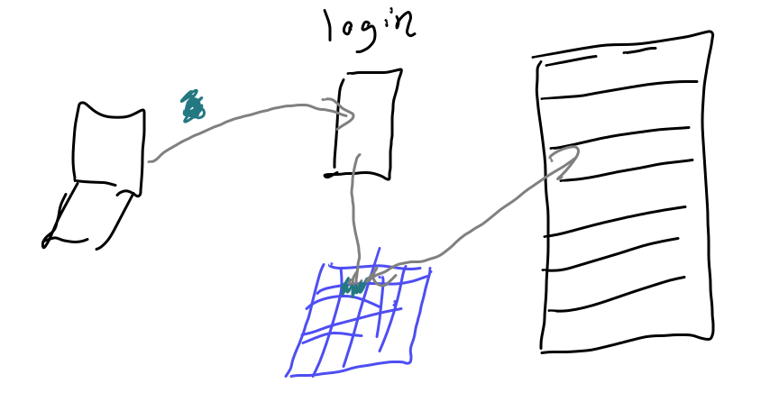

# How Can I use a remote server


## What are remote servers and HPC systems?




+++{"lesson_part": "main"}


## Connecting to Seawulf

We connect with secure shell or `ssh` from our terminal (GitBash or Putty on windows) to URI's teaching High Performance Computing (HPC) Cluster [Seawulf](https://web.uri.edu/hpc-research-computing/using-seawulf/).  

````{margin}
```{warning}
This cluster is for course related purposes at URI, if you want to use a HPC system of some sort for a side project, consider Amazon Web Services, Google Cloud, or Microsoft Azul services, you can get some allocation for free as a student.  

If you are doing research supervised by a URI professor, there are other servers on campus and URI participates in a regional HPC resource as well.
```
````

Our login is the part of your uri e-mail address before the @

+++{"lesson_part": "main"}

```{code-cell} bash
:tags: ["skip-execution"]
ssh -l brownsarahm seawulf.uri.edu
```

When it logs in it looks like this and requires you to change your password.  They configure it with a default and with it past expired. Please note the command  `ssh -l`, includes a lowercase  "L" not the number 1!

```{note}
This block is sort of weird, because it is interactive terminal.  I have rendered it all as output, but broken it down to separate chunks to add explanation.   
```


```{code-block} console
The authenticity of host 'seawulf.uri.edu (131.128.217.210)' can't be established.
ECDSA key fingerprint is SHA256:RwhTUyjWLqwohXiRw+tYlTiJEbqX2n/drCpkIwQVCro.
Are you sure you want to continue connecting (yes/no/[fingerprint])? y
Please type 'yes', 'no' or the fingerprint: yes
```

Follow the instruction to type `yes`

I will tell you how to find your default password if you missed class (do not want to post it publicly). Comment on your experience report PR to ask for this information and @ mention me (brownsarahm). 

```{code-block} console
Warning: Permanently added 'seawulf.uri.edu,131.128.217.210' (ECDSA) to the list of known hosts.
brownsarahm@seawulf.uri.edu's password:
```

It does not show charachters when you type your password, but it works when you press enter

Then it requires you to change your password
```{code-block} console
You are required to change your password immediately (root enforced)
WARNING: Your password has expired.
You must change your password now and login again!
```

To change, it asks for you current (default) password first, 

```{important}
You use the default password when prompted for your username's password. Then again when it asks for the `(current) UNIX password:`. Then you must type the same, new password twice. 

**Choose a new password you will remember, we will come back to this server**
```

```{code-block} console
Changing password for user brownsarahm.
Changing password for brownsarahm.
(current) UNIX password:
```

then the new one twice

```{code-block} console
New password:
Retype new password:
passwd: all authentication tokens updated successfully.
Connection to seawulf.uri.edu closed.
```


after you give it a new password, then it logs you out and you have to log back in.


+++{"lesson_part": "main"}
We log in again with the same command: 

```{code-cell} bash
:tags: ["skip-execution"]
ssh -l brownsarahm seawulf.uri.edu
```

+++{"lesson_part": "main","type":"output"}

```{code-block} console
brownsarahm@seawulf.uri.edu's password: 
Last login: Thu Oct 23 12:39:42 2025 from 172.20.24.214
```

+++{"lesson_part": "main"}
We can use bash commands. This is the most common shell, and remote servers where you typically cannot choose the shell are one of the most important reasons to learn a shell that is popular. 

```{code-cell} bash
:tags: ["skip-execution"]
pwd
```

+++{"lesson_part": "main","type":"output"}

```{code-block} console
/home/brownsarahm
```

+++{"lesson_part": "main"}
## Downloading files

`wget` allows you to get files from the web. 

+++{"lesson_part": "main"}

```{code-cell} bash
:tags: ["skip-execution"]
wget http://www.hpc-carpentry.org/hpc-shell/files/bash-lesson.tar.gz
```

+++{"lesson_part": "main","type":"output"}

```{code-block} console
--2025-10-23 12:46:51--  http://www.hpc-carpentry.org/hpc-shell/files/bash-lesson.tar.gz
Resolving www.hpc-carpentry.org (www.hpc-carpentry.org)... 172.64.80.1
Connecting to www.hpc-carpentry.org (www.hpc-carpentry.org)|172.64.80.1|:80... connected.
HTTP request sent, awaiting response... 200 OK
Length: 12534006 (12M) [application/gzip]
Saving to: ‘bash-lesson.tar.gz’

100%[=======================>] 12,534,006  19.8MB/s   in 0.6s   

2025-10-23 12:46:52 (19.8 MB/s) - ‘bash-lesson.tar.gz’ saved [12534006/12534006]

```

Note that this is a reasonably sized download and it finished very quickly.  This is because the download happened **on the remote server** not your laptop.  The server has a high quality hard-wired connection to the internet that is very fast, unlike the wifi in our classroom. 

This is an advantage of using a remote system.  If your connection is slow, but stable enough to connect, you can do the work on a different computer that has better connection. 

Now we see we have the file. 

+++{"lesson_part": "main"}

We can use `ls` with `-l` to see more information about the files. 
```{code-cell} bash
:tags: ["skip-execution"]
ls -l
```

+++{"lesson_part": "main","type":"output"}

```{code-block} console
total 113036
-rw-r--r--. 1 brownsarahm spring2022-csc392 12534006 Apr 18  2021 bash-lesson.tar.gz
```

+++{"lesson_part": "main"}
the `-h` flag makes the file sizes more readable

```{code-cell} bash
:tags: ["skip-execution"]
ls -lh
```

+++{"lesson_part": "main","type":"output"}

```{code-block} console
total 111M
-rw-r--r--. 1 brownsarahm spring2022-csc392  12M Apr 18  2021 bash-lesson.tar.gz
```

the file was 12MB and downloaded very fast! that is an advantage of using the remote server, your work is not impacted by slow wifi. 
+++{"lesson_part": "main"}

## Unzipping a file on the command line

This file is compressed.  

We can use `man tar` to see the manual aka man file of the `tar` program to learn how it works.  You can also read man files [online from GNU](https://www.gnu.org/software/tar/manual/) where you can choose your format, [this page shows the full version](https://www.gnu.org/software/tar/manual/tar.html). 

+++{"lesson_part": "main"}

```{code-cell} bash
:tags: ["skip-execution"]
tar -xvf bash-lesson.tar.gz 
```


This command uses the `tar` program and: 
- `v` makes it verbose (I have cut this output here)
- `x` makes it extract
- `f` option accepts the file name to work on

We can see what it did with `ls`

+++{"lesson_part": "main","type":"output"}

```{code-block} console
dmel-all-r6.19.gtf
dmel_unique_protein_isoforms_fb_2016_01.tsv
gene_association.fb
SRR307023_1.fastq
SRR307023_2.fastq
SRR307024_1.fastq
SRR307024_2.fastq
SRR307025_1.fastq
SRR307025_2.fastq
SRR307026_1.fastq
SRR307026_2.fastq
SRR307027_1.fastq
SRR307027_2.fastq
SRR307028_1.fastq
SRR307028_2.fastq
SRR307029_1.fastq
SRR307029_2.fastq
SRR307030_1.fastq
SRR307030_2.fastq
```

+++{"lesson_part": "main"}

**Note:** 
To extract files to a different directory use the option ```--directory```
```--directory path/to/directory```

+++{"lesson_part": "main"}


## Working with large files

Today we will learn a few more bash commands. 

:::::{admonition} ⚓ Document them
Add the new commands to the [resources section](#bashcommands) of this site for a community badge. 
::::::

+++{"lesson_part": "main"}
let's first look at the size of the files
```{code-cell} bash
:tags: ["skip-execution"]
ls -lh
```

+++{"lesson_part": "main","type":"output"}

```{code-block} console
total 136M
-rw-r--r--. 1 brownsarahm spring2022-csc392  12M Apr 18  2021 bash-lesson.tar.gz
-rw-r--r--. 1 brownsarahm spring2022-csc392  74M Jan 16  2018 dmel-all-r6.19.gtf
-rw-r--r--. 1 brownsarahm spring2022-csc392 705K Jan 25  2016 dmel_unique_protein_isoforms_fb_2016_01.tsv
-rw-r--r--. 1 brownsarahm spring2022-csc392  24M Jan 25  2016 gene_association.fb
-rw-r--r--. 1 brownsarahm spring2022-csc392 1.6M Jan 25  2016 SRR307023_1.fastq
-rw-r--r--. 1 brownsarahm spring2022-csc392 1.6M Jan 25  2016 SRR307023_2.fastq
-rw-r--r--. 1 brownsarahm spring2022-csc392 1.6M Jan 25  2016 SRR307024_1.fastq
-rw-r--r--. 1 brownsarahm spring2022-csc392 1.6M Jan 25  2016 SRR307024_2.fastq
-rw-r--r--. 1 brownsarahm spring2022-csc392 1.6M Jan 25  2016 SRR307025_1.fastq
-rw-r--r--. 1 brownsarahm spring2022-csc392 1.6M Jan 25  2016 SRR307025_2.fastq
-rw-r--r--. 1 brownsarahm spring2022-csc392 1.6M Jan 25  2016 SRR307026_1.fastq
-rw-r--r--. 1 brownsarahm spring2022-csc392 1.6M Jan 25  2016 SRR307026_2.fastq
-rw-r--r--. 1 brownsarahm spring2022-csc392 1.6M Jan 25  2016 SRR307027_1.fastq
-rw-r--r--. 1 brownsarahm spring2022-csc392 1.6M Jan 25  2016 SRR307027_2.fastq
-rw-r--r--. 1 brownsarahm spring2022-csc392 1.6M Jan 25  2016 SRR307028_1.fastq
-rw-r--r--. 1 brownsarahm spring2022-csc392 1.6M Jan 25  2016 SRR307028_2.fastq
-rw-r--r--. 1 brownsarahm spring2022-csc392 1.6M Jan 25  2016 SRR307029_1.fastq
-rw-r--r--. 1 brownsarahm spring2022-csc392 1.6M Jan 25  2016 SRR307029_2.fastq
-rw-r--r--. 1 brownsarahm spring2022-csc392 1.6M Jan 25  2016 SRR307030_1.fastq
-rw-r--r--. 1 brownsarahm spring2022-csc392 1.6M Jan 25  2016 SRR307030_2.fastq
drwxr-xr-x. 2 brownsarahm spring2022-csc392   97 Dec  3  2024 time
```

+++{"lesson_part": "main"}

Let's try to look at the really big one

```{code-cell} bash
:tags: ["skip-execution"]
cat dmel-all-r6.19.gtf 
```

+++{"lesson_part": "main","type":"output"}

```{code-block} console
X	FlyBase	gene	19961297	19969323	.	+	.	gene_id "FBgn0031081"; gene_symbol "Nep3";

2L	FlyBase	stop_codon	2043181	2043183	.	+	0	gene_id "FBgn0003557"; gene_symbol "Su(dx)"; transcript_id "FBtr0339529"; transcript_symbol "Su(dx)-RF";
2L	FlyBase	stop_codon	782822	782824	.	+	0	gene_id "FBgn0041250"; gene_symbol "Gr21a"; transcript_id "FBtr0331651"; transcript_symbol "Gr21a-RB";
2L	FlyBase	3UTR	782825	782885	.	+	.	gene_id "FBgn0041250"; gene_symbol "Gr21a"; transcript_id "FBtr0331651"; transcript_symbol "Gr21a-RB";
```
::::{margin}
```{warning}
this output is truncated for display purposes
```
::::


We see that this actually take a long time to output and is way tooo much information to actually read.  In fact, in order to make the website work, I had to cut that content using command line tools, my text editor couldn't open the file and GitHub was unhappy when I pushed it.


:::{note}
to truncate the output above, in the past, I took the terminal saved output and did the following: 

```
grep -n cat 2024-10-24.md
```
to get the line number of the `cat` 
and then 
```
head -n 156 2024-10-24.md > today.md
```
to take the part above the `cat` and then
```
grep -n head 2024-10-24.md
```
to find the next command, `head` and then
```
tail -n +20150 2024-10-24.md > tmp.md
```
to keep the lines after line 20150 in a temp file, 
and repeat to find the rest of the lines to cut the pieces needed, taking the head off and saving. 

However, this year, I tried just opening the whole way to long file in VScode because I forgot and it actually worked! 
:::


+++{"lesson_part": "main"}
### Look at the top

We can look at the top of a file with `head`
```{code-cell} bash
:tags: ["skip-execution"]
head dmel-all-r6.19.gtf 
```

+++{"lesson_part": "main","type":"output"}

```{code-block} console
X	FlyBase	gene	19961297	19969323	.	+	.	gene_id "FBgn0031081"; gene_symbol "Nep3";
X	FlyBase	mRNA	19961689	19968479	.	+	.	gene_id "FBgn0031081"; gene_symbol "Nep3"; transcript_id "FBtr0070000"; transcript_symbol "Nep3-RA";
X	FlyBase	5UTR	19961689	19961845	.	+	.	gene_id "FBgn0031081"; gene_symbol "Nep3"; transcript_id "FBtr0070000"; transcript_symbol "Nep3-RA";
X	FlyBase	exon	19961689	19961845	.	+	.	gene_id "FBgn0031081"; gene_symbol "Nep3"; transcript_id "FBtr0070000"; transcript_symbol "Nep3-RA";
X	FlyBase	exon	19963955	19964071	.	+	.	gene_id "FBgn0031081"; gene_symbol "Nep3"; transcript_id "FBtr0070000"; transcript_symbol "Nep3-RA";
X	FlyBase	exon	19964782	19964944	.	+	.	gene_id "FBgn0031081"; gene_symbol "Nep3"; transcript_id "FBtr0070000"; transcript_symbol "Nep3-RA";
X	FlyBase	exon	19965006	19965126	.	+	.	gene_id "FBgn0031081"; gene_symbol "Nep3"; transcript_id "FBtr0070000"; transcript_symbol "Nep3-RA";
X	FlyBase	exon	19965197	19965511	.	+	.	gene_id "FBgn0031081"; gene_symbol "Nep3"; transcript_id "FBtr0070000"; transcript_symbol "Nep3-RA";
X	FlyBase	exon	19965577	19966071	.	+	.	gene_id "FBgn0031081"; gene_symbol "Nep3"; transcript_id "FBtr0070000"; transcript_symbol "Nep3-RA";
X	FlyBase	exon	19966183	19967012	.	+	.	gene_id "FBgn0031081"; gene_symbol "Nep3"; transcript_id "FBtr0070000"; transcript_symbol "Nep3-RA";
```


+++{"lesson_part": "main"}

```{code-cell} bash
:tags: ["skip-execution"]
man head
```


+++{"lesson_part": "main"}
the `-n` {term}`flag` to change how many lines we get back
```{code-cell} bash
:tags: ["skip-execution"]
head -n 5 dmel-all-r6.19.gtf 
```

+++{"lesson_part": "main","type":"output"}

```{code-block} console
X	FlyBase	gene	19961297	19969323	.	+	.	gene_id "FBgn0031081"; gene_symbol "Nep3";
X	FlyBase	mRNA	19961689	19968479	.	+	.	gene_id "FBgn0031081"; gene_symbol "Nep3"; transcript_id "FBtr0070000"; transcript_symbol "Nep3-RA";
X	FlyBase	5UTR	19961689	19961845	.	+	.	gene_id "FBgn0031081"; gene_symbol "Nep3"; transcript_id "FBtr0070000"; transcript_symbol "Nep3-RA";
X	FlyBase	exon	19961689	19961845	.	+	.	gene_id "FBgn0031081"; gene_symbol "Nep3"; transcript_id "FBtr0070000"; transcript_symbol "Nep3-RA";
X	FlyBase	exon	19963955	19964071	.	+	.	gene_id "FBgn0031081"; gene_symbol "Nep3"; transcript_id "FBtr0070000"; transcript_symbol "Nep3-RA";
```

+++{"lesson_part": "main"}
or the `--lines` {term}`option`

```{code-cell} bash
:tags: ["skip-execution"]
head --lines 5 dmel-all-r6.19.gtf 
```

+++{"lesson_part": "main","type":"output"}

```{code-block} console
X	FlyBase	gene	19961297	19969323	.	+	.	gene_id "FBgn0031081"; gene_symbol "Nep3";
X	FlyBase	mRNA	19961689	19968479	.	+	.	gene_id "FBgn0031081"; gene_symbol "Nep3"; transcript_id "FBtr0070000"; transcript_symbol "Nep3-RA";
X	FlyBase	5UTR	19961689	19961845	.	+	.	gene_id "FBgn0031081"; gene_symbol "Nep3"; transcript_id "FBtr0070000"; transcript_symbol "Nep3-RA";
X	FlyBase	exon	19961689	19961845	.	+	.	gene_id "FBgn0031081"; gene_symbol "Nep3"; transcript_id "FBtr0070000"; transcript_symbol "Nep3-RA";
X	FlyBase	exon	19963955	19964071	.	+	.	gene_id "FBgn0031081"; gene_symbol "Nep3"; transcript_id "FBtr0070000"; transcript_symbol "Nep3-RA";
```

+++{"lesson_part": "main"}

The flag also works without a space. 
```{code-cell} bash
:tags: ["skip-execution"]
head -n5 dmel-all-r6.19.gtf 
```

+++{"lesson_part": "main","type":"output"}

```{code-block} console
X	FlyBase	gene	19961297	19969323	.	+	.	gene_id "FBgn0031081"; gene_symbol "Nep3";
X	FlyBase	mRNA	19961689	19968479	.	+	.	gene_id "FBgn0031081"; gene_symbol "Nep3"; transcript_id "FBtr0070000"; transcript_symbol "Nep3-RA";
X	FlyBase	5UTR	19961689	19961845	.	+	.	gene_id "FBgn0031081"; gene_symbol "Nep3"; transcript_id "FBtr0070000"; transcript_symbol "Nep3-RA";
X	FlyBase	exon	19961689	19961845	.	+	.	gene_id "FBgn0031081"; gene_symbol "Nep3"; transcript_id "FBtr0070000"; transcript_symbol "Nep3-RA";
X	FlyBase	exon	19963955	19964071	.	+	.	gene_id "FBgn0031081"; gene_symbol "Nep3"; transcript_id "FBtr0070000"; transcript_symbol "Nep3-RA";
```

+++{"lesson_part": "main"}
### Looking at the bottom

We can look at the bottom with `tail`

```{code-cell} bash
:tags: ["skip-execution"]
tail -n 2 dmel-all-r6.19.gtf 
```


+++{"lesson_part": "main","type":"output"}

```{code-block} console
2L	FlyBase	stop_codon	782822	782824	.	+	0	gene_id "FBgn0041250"; gene_symbol "Gr21a"; transcript_id "FBtr0331651"; transcript_symbol "Gr21a-RB";
2L	FlyBase	3UTR	782825	782885	.	+	.	gene_id "FBgn0041250"; gene_symbol "Gr21a"; transcript_id "FBtr0331651"; transcript_symbol "Gr21a-RB";
```
### Analyzing the file

+++{"lesson_part": "main"}

For a file like this, we don't really want to read the whole file but we do need to know what it's strucutred like in order to design programs to work with it.  


+++{"lesson_part": "main"}

We can also see how much content is in the file `wc` give a  line count, word count, and byte count

```{code-cell} bash
:tags: ["skip-execution"]
wc dmel-all-r6.19.gtf 
```

+++{"lesson_part": "main","type":"output"}

```{code-block} console
  542048  8638933 77426528 dmel-all-r6.19.gtf
```

+++{"lesson_part": "main"}
with `-l` it gives only the line count
```{code-cell} bash
:tags: ["skip-execution"]
wc -l dmel-all-r6.19.gtf 
```

+++{"lesson_part": "main","type":"output"}

```{code-block} console
542048 dmel-all-r6.19.gtf
```

+++{"lesson_part": "main"}

::::::{exercise}
:label: linelengths
Use `man` and `wc` to find out if all of the lines are the same length or not
:::::::

::::::{hint}
:class: dropdown
```{code-cell} bash
:tags: ["skip-execution"]
man wc
```


::::::::{solution} linelengths
:class: dropdown

first see the overall max length
```{code-cell} bash
:tags: ["skip-execution"]
wc -L dmel-all-r6.19.gtf 
```


```{code-block} console
:label: maxline
304 dmel-all-r6.19.gtf
```

then get the total number of characters

```{code-cell} bash
:tags: ["skip-execution"]
wc -m dmel-all-r6.19.gtf 
```


```{code-block} console
:label: charct
77426528 dmel-all-r6.19.gtf
```

and lines

```{code-cell} bash
:tags: ["skip-execution"]
wc -l dmel-all-r6.19.gtf 
```


```{code-block} console
:label: linect
542048 dmel-all-r6.19.gtf
```

Then see if the total number of characters is equalt to the max line length * the numbe rof lines
```{code-cell} python
304*542048
```

This is a lot bigger than the [total character count](#charct) from above

We can also look at the max line length on an excerpt of the file: 

```{code-cell} bash
:tags: ["skip-execution"]
head dmel-all-r6.19.gtf | wc -L 
```

```{code-block} console
180
```

or at the bottom

```{code-cell} bash
:tags: ["skip-execution"]
tail dmel-all-r6.19.gtf | wc -L 
```

```{code-block} console
174
```

Since `-L` gives us different numbers depending on what we give we know it's not uniform. 

:::::::::::

+++{"lesson_part": "main"}
## Working with multiple files 

let's recall what files we have: 
```{code-cell} bash
:tags: ["skip-execution"]
ls
```

+++{"lesson_part": "main","type":"output"}

```{code-block} console
bash-lesson.tar.gz                           SRR307024_2.fastq  SRR307028_1.fastq
dmel-all-r6.19.gtf                           SRR307025_1.fastq  SRR307028_2.fastq
dmel_unique_protein_isoforms_fb_2016_01.tsv  SRR307025_2.fastq  SRR307029_1.fastq
gene_association.fb                          SRR307026_1.fastq  SRR307029_2.fastq
SRR307023_1.fastq                            SRR307026_2.fastq  SRR307030_1.fastq
SRR307023_2.fastq                            SRR307027_1.fastq  SRR307030_2.fastq
SRR307024_1.fastq                            SRR307027_2.fastq  time
```

+++{"lesson_part": "main"}
We can use `wc` with patterns
```{code-cell} bash
:tags: ["skip-execution"]
wc -l *.fastq
```

+++{"lesson_part": "main","type":"output"}

```{code-block} console
   20000 SRR307023_1.fastq
   20000 SRR307023_2.fastq
   20000 SRR307024_1.fastq
   20000 SRR307024_2.fastq
   20000 SRR307025_1.fastq
   20000 SRR307025_2.fastq
   20000 SRR307026_1.fastq
   20000 SRR307026_2.fastq
   20000 SRR307027_1.fastq
   20000 SRR307027_2.fastq
   20000 SRR307028_1.fastq
   20000 SRR307028_2.fastq
   20000 SRR307029_1.fastq
   20000 SRR307029_2.fastq
   20000 SRR307030_1.fastq
   20000 SRR307030_2.fastq
  320000 total
```

+++{"lesson_part": "main"}

In this case the result would be the same with only the q
```{code-cell} bash
:tags: ["skip-execution"]
wc -l *q
```

+++{"lesson_part": "main","type":"output"}

```{code-block} console
   20000 SRR307023_1.fastq
   20000 SRR307023_2.fastq
   20000 SRR307024_1.fastq
   20000 SRR307024_2.fastq
   20000 SRR307025_1.fastq
   20000 SRR307025_2.fastq
   20000 SRR307026_1.fastq
   20000 SRR307026_2.fastq
   20000 SRR307027_1.fastq
   20000 SRR307027_2.fastq
   20000 SRR307028_1.fastq
   20000 SRR307028_2.fastq
   20000 SRR307029_1.fastq
   20000 SRR307029_2.fastq
   20000 SRR307030_1.fastq
   20000 SRR307030_2.fastq
  320000 total
```

+++{"lesson_part": "main"}

We can also redirect that to a file
```{code-cell} bash
:tags: ["skip-execution"]
wc -l *.fastq > linecounts.txt
```


+++{"lesson_part": "main"}

```{code-cell} bash
:tags: ["skip-execution"]
cat linecounts.txt 
```

+++{"lesson_part": "main","type":"output"}

```{code-block} console
   20000 SRR307023_1.fastq
   20000 SRR307023_2.fastq
   20000 SRR307024_1.fastq
   20000 SRR307024_2.fastq
   20000 SRR307025_1.fastq
   20000 SRR307025_2.fastq
   20000 SRR307026_1.fastq
   20000 SRR307026_2.fastq
   20000 SRR307027_1.fastq
   20000 SRR307027_2.fastq
   20000 SRR307028_1.fastq
   20000 SRR307028_2.fastq
   20000 SRR307029_1.fastq
   20000 SRR307029_2.fastq
   20000 SRR307030_1.fastq
   20000 SRR307030_2.fastq
  320000 total
```


::::::::{exercise}
:label: nototal

Modify the line above so that the linecounts.txt file does not include the total.

::::{hint}
:class: dropdown
Do not manually count the number of files
:::::

::::::{hint}
:class: dropdown
remember that `$()` can be used to run a command and use its output with another.

[see how we did that with a loop](#nesting)
::::::::

:::::::::::

+++{"lesson_part": "main"}
::::::{solution} nototal
:class: dropdown

```{code-cell} bash
:tags: ["skip-execution"]
wc -l *.fastq |head -n $(ls *.fastq | wc -l) >linecounts.txt
```
::::::::::::::


+++{"lesson_part": "main"}
remember to exit


+++{"lesson_part": "main"}

```{code-cell} bash
:tags: ["skip-execution"]
exit
```

+++{"lesson_part": "main","type":"output"}

```{code-block} console
logout
Connection to seawulf.uri.edu closed.
```

+++{"lesson_part": "main"}

```{code-cell} bash
:tags: ["skip-execution"]

```

We can get interactive sessions on compute nodes using [`salloc`](https://slurm.schedmd.com/salloc.html) or send jobs to be processed in batch with [`sbatch`](https://slurm.schedmd.com/sbatch.html)

## Prepare for Next Class 

```{include} ../_prepare/2025-10-28.md
```

## Badges

`````{tab-set}
````{tab-item} Review
```{include} ../_review/2025-10-23.md
```

````

````{tab-item} Practice
```{include} ../_practice/2025-10-23.md
```

````
`````


## Experience Report Evidence

Nothing extra, just answer the questions and be sure to do the exercises and share if you had any trouble with them.  

## Questions After Today's Class 

::::{warning}

These will be added late for today
:::::
